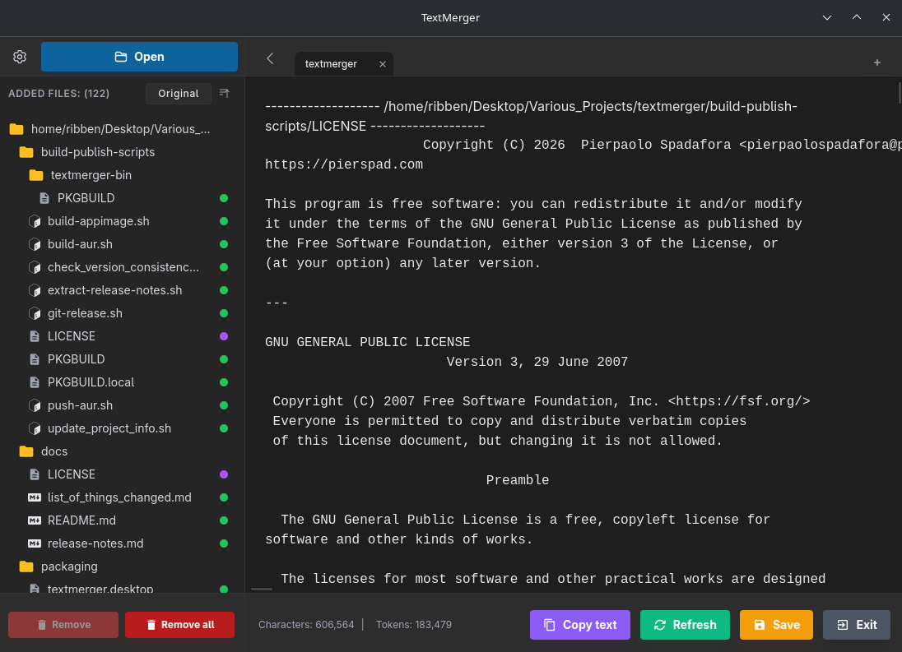

#  TextMerger

[](https://github.com/pierspad/textmerger/actions/workflows/main.yml)
[](https://github.com/pierspad/textmerger/releases/latest)

[](https://github.com/sponsors/pierspad) [](https://buymeacoffee.com/pierspad) [](https://ko-fi.com/pierspad)

Merge files and folders into one text output. Preview, copy or save the result.



## Features

- Drag and drop files or folders; organize independent sessions in tabs.
- Exclude paths with patterns, hide individual files and limit content per file.
- Keep file headers, refresh changed files and copy or save the merged output.
- Count characters and estimate tokens with a selectable tokenizer.
- Extract PDF text, choose notebook output verbosity and inspect media metadata.
- File type icons, configurable shortcuts, keyboard navigation and light/dark themes.
- Interface in 15 languages.

## Supported files

| Files | Output |
|---|---|
| UTF-8 or BOM-marked UTF-16 text, source code, markup, configuration, CSV/TSV, subtitles | Text, regardless of extension; up to 10 MiB per file |
| PDF | Embedded text; no OCR for scanned pages |
| Jupyter (`.ipynb`) | Cell sources, with text outputs omitted, limited to 10 lines per cell, or included in full |
| JPEG, PNG, GIF, BMP, WebP | File information, dimensions and available metadata |
| MP4, MOV, AVI, MKV, WebM, M4V, 3GP | File information and available metadata |

Other binary files and unsupported text encodings are rejected. Images and videos contribute metadata, not their visual content. File icons identify types; they do not imply content extraction support.

## Installation

Download a package from [Releases](https://github.com/pierspad/textmerger/releases/latest).

| Platform | Package |
|---|---|
| Windows | `.exe` (NSIS) or `.msi` |
| Debian / Ubuntu | `.deb`: `sudo apt install ./textmerger_<version>_amd64.deb` |
| Fedora | `.rpm`: `sudo dnf install ./textmerger-<version>-1.x86_64.rpm` |
| openSUSE | `.rpm`: `sudo zypper install ./textmerger-<version>-1.x86_64.rpm` |
| Arch Linux / AUR | `yay -S textmerger-bin` or `paru -S textmerger-bin` |
| Other Linux distributions | `.AppImage`: make executable, then run |

Use the actual downloaded filename in the commands above.

## Building from source

Requires Rust 1.97+, Node.js 22.12+ and npm. Linux also needs the Tauri development libraries:

```sh
# Debian / Ubuntu
sudo apt install build-essential pkg-config libwebkit2gtk-4.1-dev \
  librsvg2-dev patchelf libgtk-3-dev libayatana-appindicator3-dev

git clone https://github.com/pierspad/textmerger.git
cd textmerger/textmerger
npm ci
npm run tauri dev
# Production packages: src-tauri/target/release/bundle/
npm run tauri build
```

See [CONTRIBUTING.md](CONTRIBUTING.md) for validation commands.

## Contributing

Bug reports and pull requests are welcome. For major changes, open an issue first. See [CONTRIBUTING.md](CONTRIBUTING.md).

## AI Disclosure

This project was developed with the assistance of Large Language Models, used to support code writing and documentation.

## License

See [LICENSE](LICENSE).
