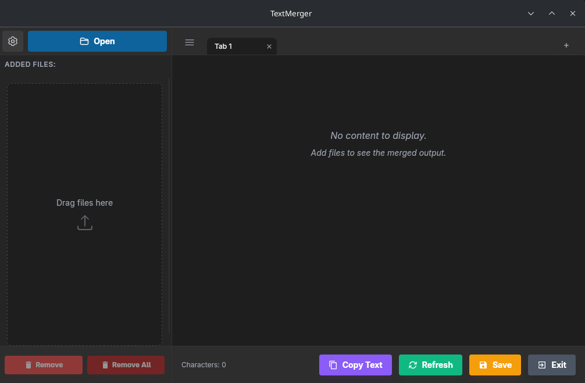

# TextMerger



[](https://www.gnu.org/licenses/gpl-3.0)
[](https://github.com/pierspad/textmerger/releases)

TextMerger is a cross-platform desktop application built with Rust/Tauri that lets you easily merge content from multiple files into one.

---

## Table of Contents

- [Features](#features)
- [Supported Formats](#supported-formats)
- [Installation](#installation)
  - [Windows](#windows)
  - [Linux](#linux)
    - [Debian/Ubuntu (.deb)](#debianubuntu-deb)
    - [Fedora/RHEL/openSUSE (.rpm)](#fedorarhelopensuse-rpm)
    - [Arch Linux (AUR)](#arch-linux-aur)
    - [AppImage (Universal)](#appimage-universal)
- [Building from Source](#building-from-source)
  - [Prerequisites](#prerequisites)
  - [Build Steps](#build-steps)
- [Contributing](#contributing)
- [AI Disclosure](#ai-disclosure)
- [License](#license)

---

## Features

- **Tabbed Interface**: Work on multiple projects at once. Create, rename, merge, and reorder tabs.
- **Drag & Drop** support for files and folders
- **Smart Filtering**: Configure global exclusion patterns (e.g., `node_modules`, `.git`)
- **One-click Copy** of merged text
- **Save** merged content to a new file
- **Toggle Preview**: Show or hide file contents in the merged output
- **Customizable Shortcuts**
- **Multi-language support** (English, Italian, German, French, Spanish)
- **Light/Dark theme**

## Supported Formats

TextMerger works with a wide range of file types, including:
- **Source code**: `.py`, `.js`, `.ts`, `.rs`, `.c`, `.cpp`, `.java`, `.go`, `.rb`, `.php`, and more
- **Web files**: `.html`, `.css`, `.scss`, `.jsx`, `.tsx`, `.vue`, `.svelte`
- **Markup & config**: `.json`, `.yaml`, `.toml`, `.xml`, `.md`, `.ini`
- **Special formats**: Jupyter Notebooks (`.ipynb`), PDFs, CSVs

---

## Installation

### Windows

Download the installer from the [Releases](https://github.com/pierspad/textmerger/releases) page:

| Format | Description |
|--------|-------------|
| `.exe` | NSIS installer (recommended) |
| `.msi` | MSI installer for enterprise deployment |

1. Download `textmerger_x.x.x_x64-setup.exe` or `textmerger_x.x.x_x64_en-US.msi`
2. Run the installer and follow the on-screen instructions
3. Launch TextMerger from the Start Menu

---

### Linux

#### Debian/Ubuntu (.deb)

Download the `.deb` package from the [Releases](https://github.com/pierspad/textmerger/releases) page and install it:

```bash
# Download (replace x.x.x with the version number)
wget https://github.com/pierspad/textmerger/releases/download/vx.x.x/textmerger_x.x.x_amd64.deb

# Install
sudo dpkg -i textmerger_x.x.x_amd64.deb

# Fix any missing dependencies
sudo apt-get install -f
```

Or install directly with `apt`:

```bash
sudo apt install ./textmerger_x.x.x_amd64.deb
```

#### Fedora/RHEL/openSUSE (.rpm)

Download the `.rpm` package from the [Releases](https://github.com/pierspad/textmerger/releases) page and install it:

```bash
# Fedora
sudo dnf install textmerger-x.x.x-1.x86_64.rpm

# RHEL/CentOS
sudo yum install textmerger-x.x.x-1.x86_64.rpm

# openSUSE
sudo zypper install textmerger-x.x.x-1.x86_64.rpm
```

#### Arch Linux (AUR)

TextMerger is available on the AUR. Install it using your favorite AUR helper:

```bash
# Using yay
yay -S textmerger

# Using paru
paru -S textmerger

# Using pamac (Manjaro)
pamac build textmerger
```

Or manually:

```bash
git clone https://aur.archlinux.org/textmerger.git
cd textmerger
makepkg -si
```

#### AppImage (Universal)

AppImage works on most Linux distributions without installation:

```bash
# Download (replace x.x.x with the version number)
wget https://github.com/pierspad/textmerger/releases/download/vx.x.x/textmerger_x.x.x_amd64.AppImage

# Make it executable
chmod +x textmerger_x.x.x_amd64.AppImage

# Run
./textmerger_x.x.x_amd64.AppImage
```

> **Tip**: You can use [AppImageLauncher](https://github.com/TheAssassin/AppImageLauncher) to integrate AppImages with your desktop environment.

---

## Building from Source

### Prerequisites

- **Rust** (1.77 or later) - [Install Rust](https://rustup.rs/)
- **Node.js** (v18 or later) and **npm** - [Install Node.js](https://nodejs.org/)
- **System dependencies** (Linux only):

  **Debian/Ubuntu:**
  ```bash
  sudo apt-get install -y \
    libwebkit2gtk-4.1-dev \
    librsvg2-dev \
    patchelf \
    libgtk-3-dev \
    libayatana-appindicator3-dev
  ```

  **Fedora:**
  ```bash
  sudo dnf install -y \
    webkit2gtk4.1-devel \
    librsvg2-devel \
    gtk3-devel \
    libappindicator-gtk3-devel \
    patchelf
  ```

  **Arch Linux:**
  ```bash
  sudo pacman -S webkit2gtk gtk3 cairo gdk-pixbuf2 glib2 pango libappindicator-gtk3
  ```

### Build Steps

1. **Clone the repository:**
   ```bash
   git clone https://github.com/pierspad/textmerger.git
   cd textmerger
   ```

2. **Navigate to the application directory:**
   ```bash
   cd textmerger
   ```

3. **Install frontend dependencies:**
   ```bash
   npm install
   ```

4. **Run in development mode:**
   ```bash
   npm run tauri dev
   ```

5. **Build for release:**
   ```bash
   npm run tauri build
   ```

   The built packages will be located in `src-tauri/target/release/bundle/`:
   - Linux: `.deb`, `.rpm`, `.AppImage`
   - Windows: `.exe`, `.msi`

---

## Contributing

Pull requests are welcome! For major changes, please open an issue first to discuss your ideas.

---

## AI Disclosure

This project was developed with the assistance of Large Language Models, used to support code writing and documentation.

---

## License

This project is licensed under the GPL v3 License – see the [LICENSE](LICENSE) file for details.
