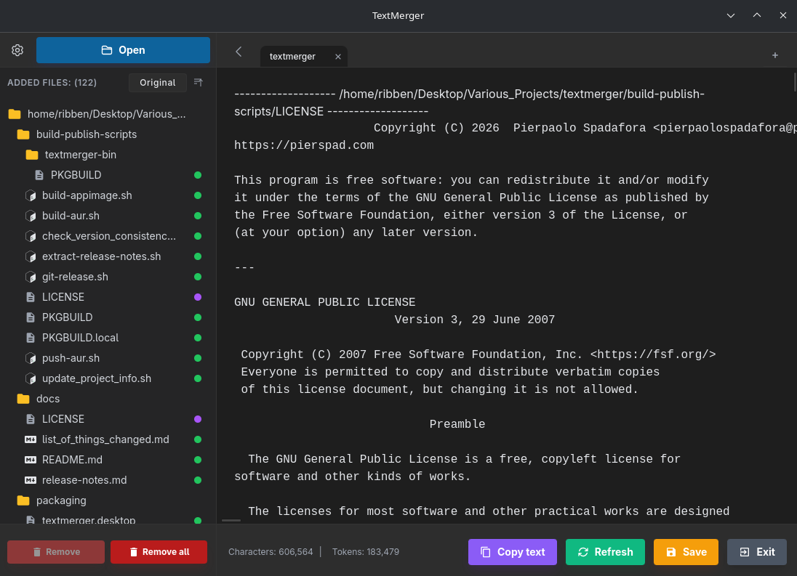

# TextMerger



[](https://www.gnu.org/licenses/gpl-3.0)
[](https://github.com/pierspad/textmerger/releases/latest)

**TextMerger** is a cross-platform desktop application that lets you collect, preview, and merge content from multiple files into a single, clean output — ready to copy, save, or paste into any tool (including AI prompts).

---

## Why TextMerger?

When working with AI assistants, code reviews, or documentation tools, you often need to feed them the contents of many files at once. TextMerger makes that effortless:

- Drop a folder in, exclude what you don't need, and copy everything in one click
- Keep multiple merge sessions open simultaneously with tabs
- Works with source code, notebooks, PDFs, CSVs, and more — not just plain text

---

## Features

### Core workflow
- **Drag & drop** files and entire folders directly into the window
- **One-click copy** — the merged output is always one click away from your clipboard
- **Save to file** — export the merged result to a new file at any time
- **Automatic refresh** — files are re-read at configurable intervals, so the output stays up to date

### Organization
- **Tabbed interface** — run multiple independent merge sessions without losing work; create, rename, reorder, and close tabs freely
- **Smart file exclusions** — define global patterns (e.g. `node_modules`, `.git`, `*.lock`) to automatically skip unwanted files and folders
- **Per-file visibility controls** — hide or show individual file contents in the output without removing the file from the list

### Output control
- **Content truncation** — set a character limit per file to keep the output manageable; expand individual files when needed
- **File headers preserved** — even when content is filtered or truncated, file paths are kept in the output for full context
- **Toggle preview** — quickly show or hide the full merged output while you're still organizing files

### Usability
- **File type icons** — at-a-glance recognition of each file's type
- **Customizable keyboard shortcuts** — with category-based filtering to quickly find what you need
- **Multi-language support** — English, Italian, German, French, Spanish
- **Light / Dark theme**
- **Full keyboard navigation** — the entire interface is accessible without a mouse

---

## Supported Formats

| Category | Extensions |
|---|---|
| Source code | `.py` `.js` `.ts` `.rs` `.c` `.cpp` `.java` `.go` `.rb` `.php` `.swift` `.kt` and more |
| Web | `.html` `.css` `.scss` `.jsx` `.tsx` `.vue` `.svelte` |
| Config & markup | `.json` `.yaml` `.toml` `.xml` `.md` `.ini` `.env` |
| Data & documents | `.csv`, PDF, Jupyter Notebooks (`.ipynb`) |

---

## Installation

### Windows

Download the installer from the [Releases](https://github.com/pierspad/textmerger/releases) page:

| Format | Description |
|--------|-------------|
| `.exe` | NSIS installer (recommended) |
| `.msi` | MSI installer for enterprise deployment |

### Linux

#### Debian / Ubuntu

```bash
sudo apt install ./textmerger_x.x.x_amd64.deb
```

#### Fedora / RHEL / openSUSE

```bash
# Fedora
sudo dnf install textmerger-x.x.x-1.x86_64.rpm

# RHEL/CentOS
sudo yum install textmerger-x.x.x-1.x86_64.rpm

# openSUSE
sudo zypper install textmerger-x.x.x-1.x86_64.rpm
```

#### Arch Linux (AUR)

```bash
yay -S textmerger
# or
paru -S textmerger
```

#### AppImage (any distro, no install required)

```bash
chmod +x textmerger_x.x.x_amd64.AppImage
./textmerger_x.x.x_amd64.AppImage
```

> **Tip:** Use [AppImageLauncher](https://github.com/TheAssassin/AppImageLauncher) to integrate AppImages with your desktop environment.

---

## Building from Source

<details>
<summary>Prerequisites & build steps</summary>

**Prerequisites:**
- [Rust](https://rustup.rs/) 1.77+
- [Node.js](https://nodejs.org/) v18+ and npm

**Linux system dependencies:**

```bash
# Debian/Ubuntu
sudo apt-get install -y libwebkit2gtk-4.1-dev librsvg2-dev patchelf libgtk-3-dev libayatana-appindicator3-dev

# Fedora
sudo dnf install -y webkit2gtk4.1-devel librsvg2-devel gtk3-devel libappindicator-gtk3-devel patchelf

# Arch Linux
sudo pacman -S webkit2gtk gtk3 cairo gdk-pixbuf2 glib2 pango libappindicator-gtk3
```

**Build:**

```bash
git clone https://github.com/pierspad/textmerger.git
cd textmerger/textmerger
npm install
npm run tauri dev      # development mode
npm run tauri build    # production build → src-tauri/target/release/bundle/
```

</details>

---

## Contributing

Pull requests are welcome! For major changes, please open an issue first to discuss your ideas.

---

## AI Disclosure

This project was developed with the assistance of Large Language Models, used to support code writing and documentation.

---

## License

This project is licensed under the GPL v3 License — see the [LICENSE](LICENSE) file for details.
